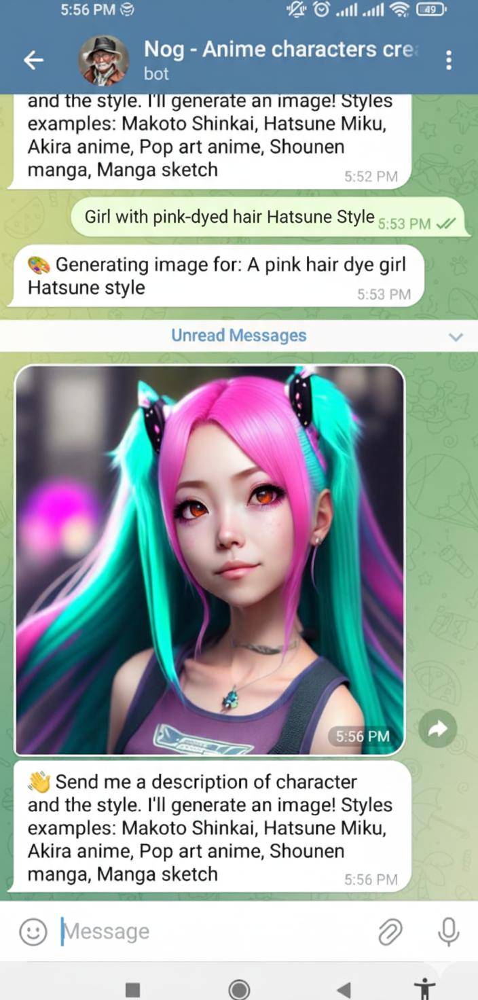
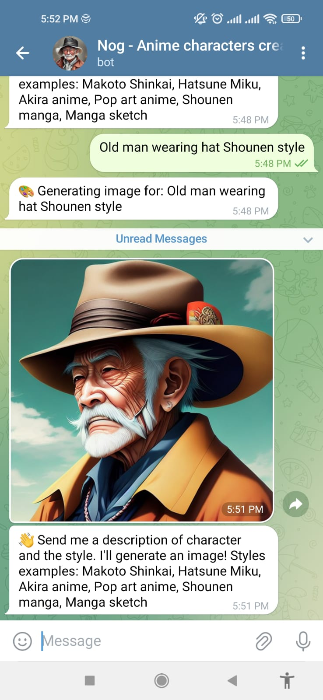
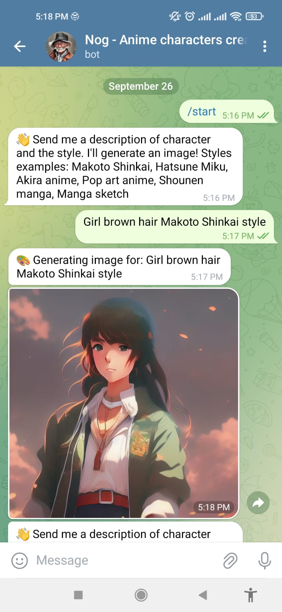
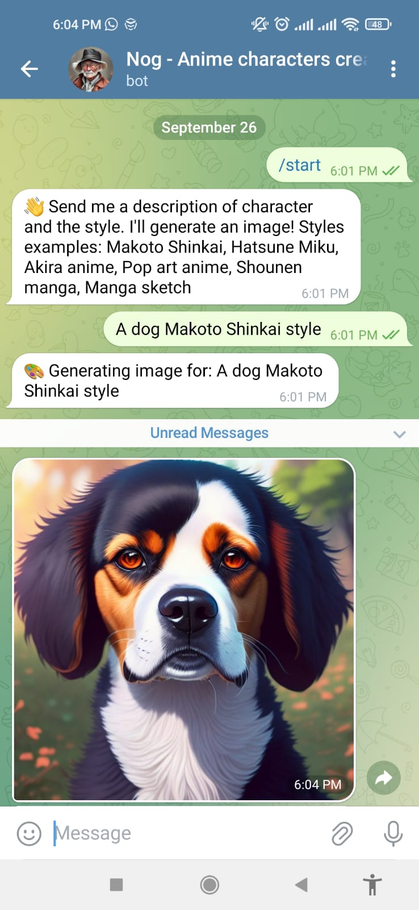

# Anime Character AI Generator

This project uses the model dreamlike-art/dreamlike-diffusion-1.0 available on Hugging Face to leverage artificial intelligence for generating and creating original anime characters. 
Users can explore a wide range of artistic styles, from highly detailed cinematic renderings to stylized manga sketches, enabling experimentation with diverse visual aesthetics.
## Features

- **AI-powered character generation**: Generate unique anime characters using text prompts or reference images.
- **Multiple artistic styles**:
  - **Makoto Shinkai style** – vivid colors, cinematic backgrounds, and emotional depth.
  - **Hatsune Miku style** – pop-culture anime character design with vibrant features.
  - **Akira anime style** – classic cyberpunk aesthetic with detailed futuristic elements.
  - **Pop Art anime style** – bold, colorful, and modernized anime-inspired visuals.
  - **Shounen manga style** – dynamic action-oriented anime characters.
  - **Manga sketch style** – raw hand-drawn sketch feel in black and white.
 

### Simple Use
Send a Telegram message to **Nog - Anime Characters Creator**.
If it is not available, please contact me (leandronog.santos@gmail.com)

## Installation
1. If you want your own bot running on your computer, do the following:
```bash
git clone https://github.com/your-username/anime-character-ai.git
cd anime-character-ai
pip install -r requirements.txt
```

## Examples
| Prompt               | Style              | Output                              |
|---------------------|------------------|------------------------------------|
| Girl with pink-dyed hair| Hatsune style |  |
| Old man wearing a hat | Shounen Style  |    |
| Girl with Brown hair | Makoto Shinkai style |     |
| A dog  | Makoto Shinkai Style  |     |
